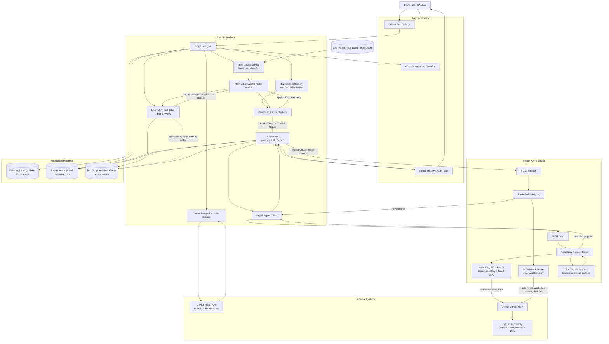
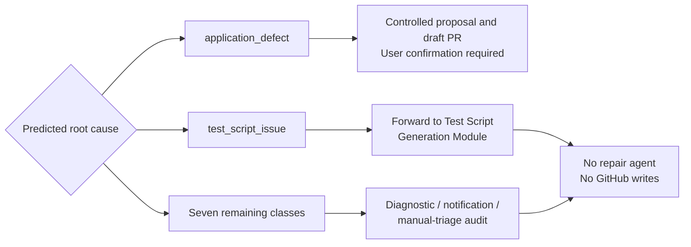
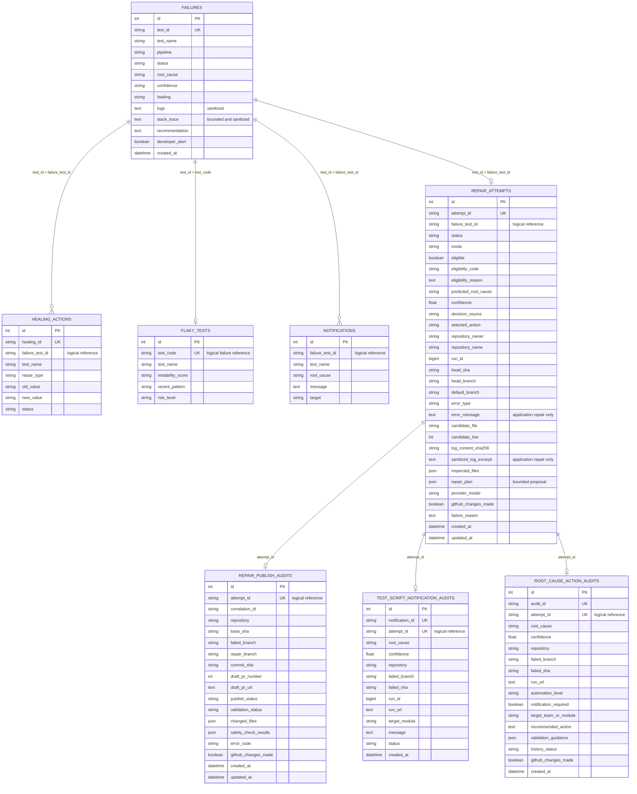
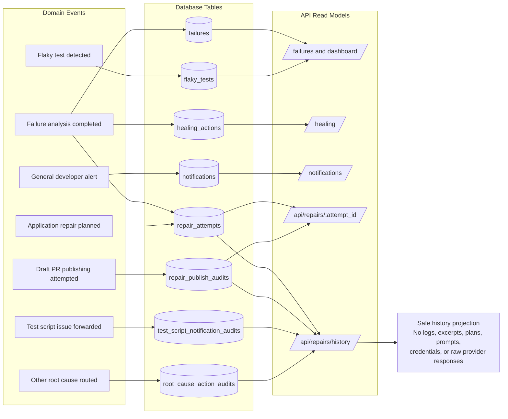

# Failure Analysis and Self-Healing Architecture

These diagrams describe the implemented system. They use Mermaid and can be
rendered in GitHub, Mermaid Live Editor, or VS Code with a Mermaid extension.

## 1. System Architecture

### Root-Cause Routing

## 2. Entity-Relationship Diagram

The application currently links records through logical identifiers. The ORM
models do not declare database-level foreign-key constraints for these links.

## 3. Database Mapping Diagram

## Security Boundaries Shown in the Diagrams

- Raw uploaded logs are processed temporarily; only bounded sanitized evidence
  and hashes are retained where required.
- Only `application_defect` can reach repair planning and publishing.
- Planning uses GitHub MCP read tools pinned to the verified repository and exact
  failed SHA.
- Publishing uses a separate write token and an `auto-heal/...` branch.
- Publishing creates one commit and one draft PR; merge tools are not exposed.
- Every non-application root cause is restricted to notification, diagnostic,
  recommendation, or manual-triage audit records with `github_changes_made=false`.
- Repair History is a safe projection and excludes logs, source code, repair-plan
  JSON, prompts, secrets, tokens, and raw MCP/OpenRouter responses.
